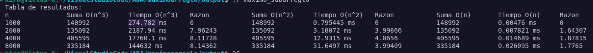

SubArreglo con numeros enteros aleatorios de -5000 a 5000 donde n es 1000, 2000, 4000, 8000 

Como se puede ver en la imagen los resultados de la suma del subarreglo mas grande no varia en O(n^3),O(n^2) y O(n), por lo tanto los metodos funcionan correctamente mientras que el tiempo de ejecucion si varia, la razon si varia ya que en O(n^3)la razon se acerca a 8,en O(n^2) la razon se acerca a 4 y O(n) la razon se acerca a 2
